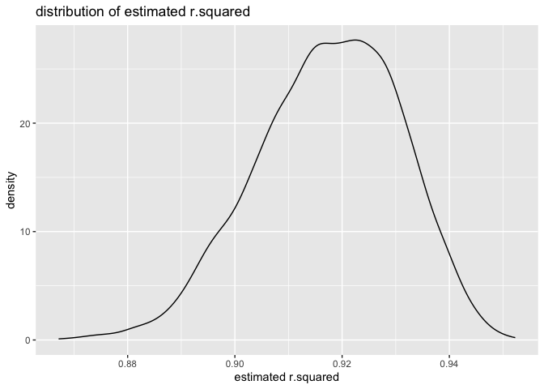

HW6
================
Ou Sha
2023-12-02

# Problem 1

``` r
# import data
homi <- read.csv("./data/homicide-data.csv")
```

``` r
# clean data 
homi <- homi|>
  # create city_state variable
  mutate(city_state = str_c(city, state, sep = ", "))|>
  # create binary variable
  mutate(resolved = case_when(disposition == "Closed without arrest" ~ 0,
                          disposition == "Open/No arrest" ~0,
                          disposition == "Closed by arrest" ~ 1))|>
  # omit cities
  filter(!(city_state %in% c("Tulsa, AL", "Dallas, TX", 
                             "Phoenix, AZ", "Kansas City, MO")))|> 
  # limit races
  filter(victim_race %in% c("White", "Black"))|>
  # make age numeric
  mutate(victim_age = as.numeric(victim_age))|>
  dplyr::select(-city, - state, -disposition)
```

``` r
# use the glm function to fit a logistic regression 
md_glm <- homi|> 
  filter(city_state == "Baltimore, MD")|> 
  dplyr::select(city_state, resolved, victim_age, victim_sex, victim_race)|>
  glm(resolved ~ victim_age + victim_race + victim_sex, data = _, family = binomial())
# save the output as an R object
save(md_glm, file = "baltimore_glm.RData")
md_glm|>
  # apply the broom::tidy to this object
  broom::tidy()|> 
  filter(term == "victim_sexMale")|> 
  mutate(OR = exp(estimate),
         OR_upper = exp(estimate + 1.96 * std.error),
         OR_lower = exp(estimate - 1.96 * std.error))|>
  dplyr::select(estimate, OR, OR_lower, OR_upper) |>
  knitr::kable(digits = 3)
```

| estimate |    OR | OR_lower | OR_upper |
|---------:|------:|---------:|---------:|
|   -0.854 | 0.426 |    0.325 |    0.558 |

``` r
# run glm for each city
all_glm <- homi|>
  nest(city = -city_state) |> 
  mutate(log_re = map(city, \(x) glm(resolved ~ victim_age + victim_sex + victim_race, 
                             family = binomial(), data = x)),
         tidy= map(log_re, broom::tidy))|> 
  unnest(tidy)|>
  filter(term == "victim_sexMale")|> 
  mutate(OR = exp(estimate),
         OR_upper = exp(estimate + 1.96 * std.error),
         OR_lower = exp(estimate - 1.96 * std.error))|>
  dplyr::select(city_state, estimate, OR, OR_lower, OR_upper)
all_glm|>
  knitr::kable(digits = 3)
```

| city_state         | estimate |    OR | OR_lower | OR_upper |
|:-------------------|---------:|------:|---------:|---------:|
| Albuquerque, NM    |    0.570 | 1.767 |    0.831 |    3.761 |
| Atlanta, GA        |    0.000 | 1.000 |    0.684 |    1.463 |
| Baltimore, MD      |   -0.854 | 0.426 |    0.325 |    0.558 |
| Baton Rouge, LA    |   -0.964 | 0.381 |    0.209 |    0.695 |
| Birmingham, AL     |   -0.139 | 0.870 |    0.574 |    1.318 |
| Boston, MA         |   -0.395 | 0.674 |    0.356 |    1.276 |
| Buffalo, NY        |   -0.653 | 0.521 |    0.290 |    0.935 |
| Charlotte, NC      |   -0.123 | 0.884 |    0.557 |    1.403 |
| Chicago, IL        |   -0.891 | 0.410 |    0.336 |    0.501 |
| Cincinnati, OH     |   -0.917 | 0.400 |    0.236 |    0.677 |
| Columbus, OH       |   -0.630 | 0.532 |    0.378 |    0.750 |
| Denver, CO         |   -0.736 | 0.479 |    0.236 |    0.971 |
| Detroit, MI        |   -0.541 | 0.582 |    0.462 |    0.734 |
| Durham, NC         |   -0.208 | 0.812 |    0.392 |    1.683 |
| Fort Worth, TX     |   -0.402 | 0.669 |    0.397 |    1.127 |
| Fresno, CA         |    0.289 | 1.335 |    0.580 |    3.071 |
| Houston, TX        |   -0.341 | 0.711 |    0.558 |    0.907 |
| Indianapolis, IN   |   -0.085 | 0.919 |    0.679 |    1.242 |
| Jacksonville, FL   |   -0.329 | 0.720 |    0.537 |    0.966 |
| Las Vegas, NV      |   -0.178 | 0.837 |    0.608 |    1.154 |
| Long Beach, CA     |   -0.891 | 0.410 |    0.156 |    1.082 |
| Los Angeles, CA    |   -0.413 | 0.662 |    0.458 |    0.956 |
| Louisville, KY     |   -0.712 | 0.491 |    0.305 |    0.790 |
| Memphis, TN        |   -0.324 | 0.723 |    0.529 |    0.988 |
| Miami, FL          |   -0.663 | 0.515 |    0.304 |    0.872 |
| Milwaukee, wI      |   -0.319 | 0.727 |    0.499 |    1.060 |
| Minneapolis, MN    |   -0.054 | 0.947 |    0.478 |    1.875 |
| Nashville, TN      |    0.034 | 1.034 |    0.685 |    1.562 |
| New Orleans, LA    |   -0.536 | 0.585 |    0.422 |    0.811 |
| New York, NY       |   -1.338 | 0.262 |    0.138 |    0.499 |
| Oakland, CA        |   -0.574 | 0.563 |    0.365 |    0.868 |
| Oklahoma City, OK  |   -0.026 | 0.974 |    0.624 |    1.520 |
| Omaha, NE          |   -0.961 | 0.382 |    0.203 |    0.721 |
| Philadelphia, PA   |   -0.701 | 0.496 |    0.378 |    0.652 |
| Pittsburgh, PA     |   -0.842 | 0.431 |    0.265 |    0.700 |
| Richmond, VA       |    0.006 | 1.006 |    0.498 |    2.033 |
| San Antonio, TX    |   -0.350 | 0.705 |    0.398 |    1.249 |
| Sacramento, CA     |   -0.402 | 0.669 |    0.335 |    1.337 |
| Savannah, GA       |   -0.143 | 0.867 |    0.422 |    1.780 |
| San Bernardino, CA |   -0.692 | 0.500 |    0.171 |    1.462 |
| San Diego, CA      |   -0.884 | 0.413 |    0.200 |    0.855 |
| San Francisco, CA  |   -0.498 | 0.608 |    0.317 |    1.165 |
| St. Louis, MO      |   -0.352 | 0.703 |    0.530 |    0.932 |
| Stockton, CA       |    0.301 | 1.352 |    0.621 |    2.942 |
| Tampa, FL          |   -0.214 | 0.808 |    0.348 |    1.876 |
| Tulsa, OK          |   -0.025 | 0.976 |    0.614 |    1.552 |
| Washington, DC     |   -0.371 | 0.690 |    0.468 |    1.017 |

``` r
# create plot 
all_glm|>
  # Organize cities according to estimated OR
  ggplot(aes(x = OR, y = fct_reorder(city_state,OR))) + 
  geom_point() + 
  geom_errorbar(aes(xmin = OR_lower, xmax = OR_upper))+
  labs(x = "odds ratio", y = "cities", title = "Estimated ORs and CIs for each city")
```

<!-- -->

Based on the plot, New York, NY has the smallest estimated odds ratio
and Albuquerque, NM has the largest estimated odds ratio with a larger
CI.

# Problem 2

``` r
# download data
weather_df = 
  rnoaa::meteo_pull_monitors(
    c("USW00094728"),
    var = c("PRCP", "TMIN", "TMAX"), 
    date_min = "2022-01-01",
    date_max = "2022-12-31") |>
  mutate(
    name = recode(id, USW00094728 = "CentralPark_NY"),
    tmin = tmin / 10,
    tmax = tmax / 10) |>
  dplyr::select(name, id, everything())
```

    ## using cached file: /Users/oi_io/Library/Caches/org.R-project.R/R/rnoaa/noaa_ghcnd/USW00094728.dly

    ## date created (size, mb): 2023-12-02 01:56:50.929836 (8.544)

    ## file min/max dates: 1869-01-01 / 2023-11-30

``` r
# produce estimate of two quantities
boot_straps <- weather_df |> 
  modelr::bootstrap(n = 5000)|>
  mutate(
    models = map(strap, \(df) lm(tmax ~ tmin + prcp, data = df) ),
    log_b = map(models, broom::tidy),
    r_2 = map(models, broom::glance))|>
  unnest(log_b, r_2)|>
  dplyr::select(.id, term, estimate, r.squared)|>
  filter(term != "(Intercept)")|>
  pivot_wider(names_from = term,
              values_from = estimate)|>
  # get log(beta1 * beta2)
  mutate(log_beta = log(tmin*prcp))
# delete NAs
boot_straps_nNA <- boot_straps|>
  na.omit()
# plot distribution of estimates
par(mfrow=c(1,2))
# r.squared
boot_straps|>
  ggplot(aes(x=r.squared))+
  geom_density() +
  labs(x = "estimated r.squared",
       title = "distribution of estimated r.squared")
```

<!-- -->

``` r
# log
boot_straps_nNA|>
  ggplot(aes(x=log_beta))+
  geom_density() +
  labs(x = "estimated log(b1*b2)",
       title = "distribution of estimated log(b1*b2)")
```

<!-- -->

The distribution of r^2 is approximately a slightly left skewed normal
distribution. All r62 values are close to 1 which indicates that a
strong linear relationship and the model we use is appropriate.  
The distribution of log(beta) is left skewed with some outliers at the
smaller edge.

``` r
# CI for r squared
quantile(pull(boot_straps, r.squared), probs = c(0.025,0.975))|>
  knitr::kable()
```

|       |         x |
|:------|----------:|
| 2.5%  | 0.8885607 |
| 97.5% | 0.9404764 |

``` r
# CI for log
quantile(pull(boot_straps_nNA, log_beta), probs = c(0.025,0.975))|>
  knitr::kable()
```

|       |         x |
|:------|----------:|
| 2.5%  | -8.921296 |
| 97.5% | -4.563491 |
